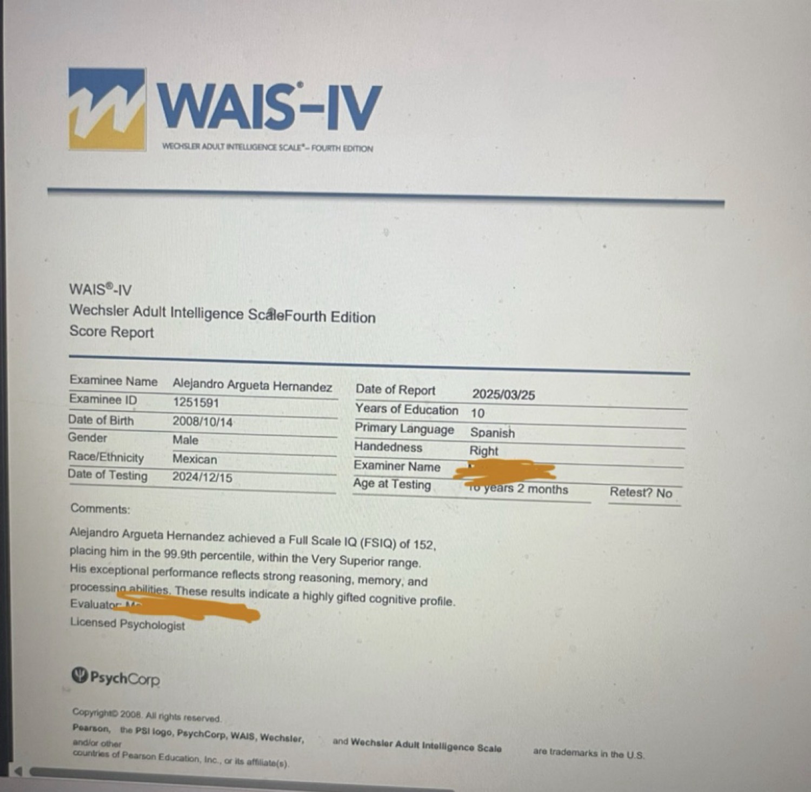

# Alejandro Argueta Hernández

**WAIS-IV Full Scale IQ: 152** (99.9th percentile)  
Test administered at 16 years 2 months (December 2024)

Full-stack engineer specializing in AI systems and agent architectures.

### Details
- Full Scale IQ (FSIQ): 152
- Percentile: 99.9
- Classification: Very Superior
- Date of Testing: December 15, 2024
- Age at Testing: 16 years 2 months
